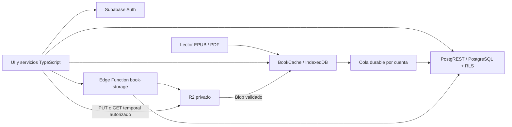

# Autumn Reader: arquitectura cloud

## Biblioteca compacta, i18n y validación de EPUB (29/09/2026)

La UI actual de biblioteca en desktop usa tarjetas horizontales de dos o más columnas según el ancho. La portada queda a la izquierda; título, autor, estado de lectura, porcentaje, estado cloud, selectores de lectura/carpeta y un menú `⋮` quedan a la derecha. El menú conserva Abrir, Sincronizar/Reintentar, Reseñar, Favorito, detalles cloud y Eliminar. El estado cloud distingue `local`, `syncing`, `error` y libro con `cloudId`; los errores de migración se recuperan del estado local al reiniciar. Lista/cuadrícula y orden se guardan en `localStorage`, y el ordenamiento usa los libros locales cargados, sin consultas nuevas. El contador de la carpeta se calcula a partir de membresías locales. En Android la tarjeta se adapta a una columna, mantiene selector de carpeta y no activa drag de desktop.

Drag & drop desktop usa Pointer Events solo para mouse con puntero fino. Tras superar 7 px aparece una copia pequeña de la portada con sombra y transición de escala, posicionada mediante `requestAnimationFrame`; la tarjeta original queda visible atenuada. `elementFromPoint` identifica una carpeta, que muestra borde, fondo y “Soltar aquí”. Drop válido llama **una sola vez** a `folders.move`: primero se refleja localmente, luego se escribe membresía/operación en IndexedDB y el outbox la sincroniza al reconectar. Drop fuera o Escape cancela sin cambiar datos. El selector de carpeta permanece como alternativa accesible. No se consulta Supabase durante el movimiento. Los libros que aún son solo locales conservan su carpeta; al subirlos, la migración existente convierte la membresía para el libro cloud.

`src/i18n.ts` ya soportaba `en`, `es`, `it` y `fr`, con idioma guardado por dispositivo y aplicación tras reiniciar. Los diccionarios aditivos `src/i18n-extra.ts` y `src/i18n-extra-more.ts` cubren las nuevas funciones y errores para los cuatro idiomas, incluidas ARIA y acciones sociales; `src/book-colors.ts` traduce los nombres de colores de carpetas/notas. TypeScript exige las mismas claves, y `tests/unit/i18n.test.ts` comprueba también placeholders y el idioma guardado. Los nombres de idiomas del selector son autónimos; `Intl.DisplayNames` presenta idiomas detectados/destino del traductor en el idioma activo. No se agregó sincronización cloud de preferencias visuales.

El error de EPUB histórico se debía a una comprobación que exigía `mimetype` como **primer miembro** ZIP, aunque EPUB.js puede leer archivos con otro orden. Algunos Blob de IndexedDB tampoco conservan MIME ni `format` moderno. Ahora se identifican los bytes: PDF con `%PDF-` y `%%EOF`; EPUB mediante firma ZIP, directorio central, `mimetype` real sin compresión con `application/epub+zip`, `META-INF/container.xml` y paquete `.opf`, sin exigir el orden de las entradas. Un ZIP cualquiera renombrado `.epub` se rechaza. `bookStorage.upload` detecta formato con el contenido completo (máximo 32 MiB), repara metadata local cuando falta y calcula SHA-256 sobre el **mismo Blob original**; nombres y MIME no alteran hash/deduplicación. La Edge Function `book-storage` usa la validación compartida al finalizar staging antes de publicar el objeto canónico/relación. Un EPUB/PDF realmente corrupto produce un error específico y conserva el libro local. El backend sigue sin fiarse de nombre, extensión, MIME o hash declarado por el cliente.

No se creó migration, tabla, variable de entorno ni función nueva en esta actualización. La última migration sigue siendo `202609290011_folder_note_colors.sql`. **Se debe volver a desplegar `book-storage`** tras revisar la versión en un proyecto de pruebas: `npx supabase functions deploy book-storage --no-verify-jwt`. `npx supabase db push` solo corresponde si aún faltan migrations anteriores; esta actualización no requiere SQL adicional. No se cambió bucket, R2 CORS ni CSP. Se probaron EPUB/PDF con MIME vacío/genérico, EPUB con `mimetype` no primero, archivo corrupto, IndexedDB histórico, estado cloud, drag offline y sync posterior. El WebView/SAF Android físico y Supabase/R2 reales aún requieren prueba manual.

## Animación de página configurable (29/09/2026)

**Configuración → Interfaz → Animación al pasar página** activa o desactiva una transición discreta en EPUB y PDF. Está activada por defecto y se guarda por dispositivo en `localStorage.autumn-page-turn-animation`; no requiere cuenta, Internet ni nueva tabla. El sistema `prefers-reduced-motion` tiene prioridad: cuando está activo, la navegación funciona sin el efecto aunque el interruptor esté encendido.

La transición existente de swipe ahora se usa también con botones, flechas del teclado y taps laterales. La página actual sigue el dedo durante el gesto o se desliza durante unos 260 ms al avanzar mediante un control. Una inclinación máxima de **2,4°** y una sombra ligera en el borde sugieren el grosor de una hoja; la página siguiente se revela debajo. El PDF copia únicamente su página visible, incluidos canvas/texto; EPUB prepara la página adyacente desde el libro ya abierto. Los bytes no se descargan otra vez, las coordenadas de notas/highlights no se transforman permanentemente y el progreso se guarda solo cuando termina un pase confirmado.

Al desactivar el interruptor, swipe, taps, botones y teclado siguen pasando páginas, inmediatamente y sin crear una vista previa visual. La selección de texto, los gestos verticales, el borde reservado de Android y las notas mantienen sus bloqueos anteriores. No hay cambios SQL, Edge Functions, R2 ni variables de entorno. Pruebas manuales: usar botones/swipe en EPUB y PDF, cancelar un swipe corto, cambiar el ajuste, reiniciar, probar movimiento reducido y repetir en Android físico para apreciar la fluidez real del WebView.

## Colores de carpetas y notas (29/09/2026)

Al crear una carpeta, **Color de la carpeta** ofrece catorce sugerencias de distintas familias cromáticas, **Otro color** con el selector nativo del dispositivo y **Automático**. Al abrirla, **Editar carpeta** permite cambiar nombre y color sin mover ni borrar libros. Un color elegido se guarda en IndexedDB junto con la carpeta y su operación de outbox, y se sincroniza con Supabase al recuperar la conexión. El color automático de las carpetas anteriores sigue derivándose de su UUID y no cambia por la migration. El texto de la carpeta alterna entre blanco y negro para conservar contraste sobre colores oscuros o claros.

Las notas EPUB/PDF mantienen sus seis colores originales y agregan ocho tonos verdes, azules, violetas, rosas y grises. **Otro color** permite elegir cualquier RGB de seis dígitos. El mismo color se aplica a la marca, resaltado y panel de notas; al editar o reabrir una nota permanece. La nota se guarda localmente de inmediato y usa la sincronización/outbox de notas existente. La validación cliente y las restricciones PostgreSQL aceptan `#RRGGBB`; no se incorporan colores arbitrarios a estilos CSS ni a SQL. No hay cambios de formato para las notas o carpetas ya guardadas.

La migration nueva **`202609290011_folder_note_colors.sql`** se aplica después de 010. Agrega `library_folders.color` opcional, amplía la restricción de `notes.color` y actualiza `sync_changes` sin modificar las migrations anteriores. Mantiene RLS de propietario, membresías, conflictos por timestamp y tombstones; una petición de cliente anterior que no envía color no elimina el color ya elegido. Ejecutar `npx supabase db push` si el proyecto está enlazado y las migrations anteriores figuran en el historial. No hay Edge Functions, secretos, variables de entorno, cambios R2 ni configuración Android nuevos. Sin esta migration los nuevos colores de nota no se podrán sincronizar con Supabase y los colores de carpeta no se conservarán entre dispositivos.

Validación: pruebas de carpeta local/offline, refresco desde cloud, aislamiento de cuenta, colores de nota EPUB/PDF, reapertura, RGB inválido y RLS. La UI se probó en Chromium escritorio y viewport/touch Android; quedan por comprobar el selector nativo del WebView Android y la sincronización contra un proyecto Supabase real.

## Actualización de organización y lectura (29/09/2026)

Se volvió a inspeccionar el estado real del repositorio antes de editar: `main.ts` y servicios actuales, lectores EPUB.js/PDF.js, PdfTextView, notas, preferencias, IndexedDB v2, outbox, las siete migrations existentes, permisos, caché R2 y adapters Kotlin/SAF. El punto de partida pasó build, 18 tests unitarios, 6 backend, 30 navegador y cargo check Windows. Las secciones de análisis del 28/09 que siguen son antecedentes, no el estado actual del lector.

La nueva implementación mantiene las librerías y los archivos locales existentes. Fases A–E: organización privada y espaciado; historial y búsqueda; gestos y transiciones; traducción desacoplada; pruebas, optimización y esta documentación. No se desplegaron servicios ni se modificaron recursos cloud.

### Carpetas privadas y outbox

Un libro tiene inicialmente **una sola carpeta**, o ninguna. **Biblioteca** muestra carpetas con silueta vectorial, nombre y cantidad de libros, más los libros **sin carpeta**. Los libros asignados quedan dentro: tocar o pulsar Enter en una carpeta abre su contenido. Volver a biblioteca devuelve a la raíz. Se eliminó por pedido del usuario el selector **Vista**, incluidas sus opciones Biblioteca/Todos los libros/Sin carpeta: la navegación es directamente por carpetas. Cada tarjeta de libro conserva el control para moverlo a otra carpeta o sacarlo eligiendo Sin carpeta. Crear, renombrar, eliminar y asignar trabajan en IndexedDB sin esperar Internet. Eliminar conserva todos los libros, bytes, notas y progreso: solo borra la organización mediante un tombstone y limpia las asignaciones. Las listas sociales existentes mantienen su esquema y visibilidad independientes.

Sin elección explícita, el color decorativo sigue derivándose del UUID de la carpeta. La migration 011 agrega un color opcional sincronizado cuando el usuario lo elige. Los nombres se insertan como texto, nunca como HTML; los largos se acortan visualmente y permanecen completos en la etiqueta accesible y en la ruta de la carpeta abierta. Las carpetas se adaptan a móvil, incluyen foco de teclado y respetan reduced-motion. Buscar en la raíz encuentra tanto nombres de carpetas como títulos de libros dentro de ellas; al abrir una carpeta o cambiar de vista se limpia la búsqueda anterior. Dentro de una carpeta, la búsqueda se limita a sus libros. Los conteos corresponden a la metadata cargada en este dispositivo; en bibliotecas paginadas se completan con Cargar más. Mover un libro no lo descarga ni lo sube a R2.

`library_folders` y `library_folder_books` tienen políticas RLS explícitas `auth.uid() = user_id`. Los clientes tienen SELECT; las mutaciones pasan exclusivamente por `sync_changes`, que comprueba cuenta, relación user_books activa y pertenencia de la carpeta. La FK compuesta impide asignar una carpeta ajena. Índices cubren propietario/actualización y propietario/carpeta/libro.

IndexedDB v3 añade stores sin tocar books. Folder/membership y operación pendiente se guardan en una misma transacción. Las operaciones folder se envían antes que las asignaciones, con el debounce/batching/versiones/reintentos existentes. Cada carpeta y cada asignación usan timestamps LWW independientes; una operación en vuelo no elimina una versión posterior. El servidor serializa cambios de organización de la misma cuenta, conserva tombstones y rechaza movimientos tardíos a carpetas eliminadas. Los refresh preservan pendientes locales.

Las carpetas sincronizan entre dispositivos de la cuenta. Un libro exclusivamente local conserva su asignación local hasta que el usuario decida subirlo; al migrarlo a su copia cloud se conserva y encola la asignación. No se suben archivos automáticamente por moverlos. El refresh pagina nombres de carpetas de 100 en 100 y carga asignaciones únicamente para IDs cloud ya presentes en la biblioteca local, en grupos de 100. No descarga libros ni consulta todas las asignaciones al iniciar. Durante la lectura no refresca carpetas por cada sync de progreso; al volver a Biblioteca, reanudar o recuperar conexión se actualizan. En bibliotecas grandes, usar Cargar más también carga la organización de esa página.

### Reseñas personales y catálogo de libros locales

Las tarjetas de libros incluyen **★ Reseñar**. El formulario usa cinco radios accesibles con estrellas, valor numérico y comentario opcional de hasta 10.000 caracteres. La información básica se puede corregir antes de publicar un libro exclusivamente local; el título/autor de una ficha ya existente son de solo lectura. **Mis reseñas** en Perfil muestra título, estrellas y comentario, edición y eliminación, con páginas de 20 y Cargar más. También aparecen en los perfiles públicos existentes. Las páginas sociales reutilizan el mismo formulario de estrellas; no se añadió otro proveedor ni se sustituyeron likes/comentarios/listas.

La nueva RPC `publish_book_review` crea una ficha de **metadata únicamente** en `public.books` cuando hace falta, y hace upsert de la reseña de `auth.uid()`. La publicación de un libro local **no crea user_books ni book_files, no sube EPUB/PDF y no consume cuota de biblioteca sincronizada**. Ninguna ficha ni reseña permite obtener una URL de descarga: la autorización de R2 sigue exigiendo relación de biblioteca y archivo privado. Para un libro sincronizado se reutiliza su UUID público. Para uno local se guarda un UUID de catálogo estable antes de la petición; reintentar no crea otra reseña del mismo libro. Las migraciones locales existentes de ese dispositivo conservan el vínculo a través de migrationSources. Importaciones independientes pueden producir fichas de catálogo distintas; no se deduplican por título ni se modificó la deduplicación física por SHA-256 de R2.

Se mantienen RLS/UNIQUE(user_id,book_id)/rating 1–5 de reviews. La RPC tiene search_path vacío, execute solo authenticated, deriva el propietario de Auth, valida tamaños/formatos y nunca modifica metadata existente ni reseñas ajenas. Los clientes siguen sin INSERT directo en books y sin acceso al esquema private. `private.review_catalog_books` tiene RLS y no tiene grants de cliente; conserva recibos para limitar a **100 fichas nuevas por cuenta en 24 horas**, incluso si se borran sus reseñas. Este límite de abuso es independiente de la cuota de archivos; editar o reseñar fichas existentes no crea nuevos recibos.

`services/reviews/personal.ts` guarda borradores y caché por propietario en el store IndexedDB `cloud_state`, sin cambio de versión ni eliminación de libros. Los borradores se guardan con debounce, al cerrar, suspender y Guardar borrador. Son privados y locales; **no se publican automáticamente** al volver Internet. Publicar requiere conexión y sesión válida; los fallos conservan el texto. Las reseñas publicadas se consultan/sincronizan al abrir Perfil; las páginas cargadas se conservan para lectura offline. Guardar notas/progreso no consulta reseñas. Borrar una reseña no elimina el libro, sus archivos ni sus notas. Las respuestas de caché anteriores a publicar/eliminar no deben sustituir el cambio confirmado.

**Configuración de esta actualización:** aplicar `202609290010_review_catalog.sql` después de 009, con `npx supabase db push` si el proyecto ya está enlazado y tiene registrado el historial anterior. También puede ejecutarse el SQL completo en SQL Editor si ese es el flujo usado para las migrations anteriores; mantener coherencia con el historial CLI antes de usar db push. No hay Edge Function nueva, nuevos secretos, nuevas variables ni cambios en R2/CORS. Sin la migration, el formulario conserva borradores e informa que la publicación aún no está configurada. No se ejecutó ninguna operación sobre producción.

**Pruebas manuales:** reseñar un EPUB/PDF exclusivamente local y comprobar que no aumenta la biblioteca cloud; revisar desde el perfil en otro dispositivo; B puede leer la reseña de A y no editarla/descargar su archivo; editar/borrar conserva el libro; offline guardar, cerrar/reabrir y recuperar borrador; seleccionar estrellas con teclado/touch, orientación móvil, teclado virtual y suspender/reanudar. Las automatizadas usan PostgreSQL local/PGlite y Chromium desktop/touch; quedan pendientes Supabase/R2 reales y Android físico.

### Página y preferencias

Configuración → Página añade line-height de 1,2–2,4 (predeterminado 1,6), separación de párrafos de 0–2,5 em (predeterminado 0,8) y Restaurar espaciado. Se guardan en `localStorage.autumn-page-spacing` con validación de valores. Son preferencias **globales del dispositivo**, como tema/familia de fuente/idioma actuales; no se añadió sincronización de preferencias que el proyecto no tenía. El tamaño de fuente por libro continúa en el modelo existente.

EPUB adaptable aplica estilos al contenido real y a capítulos nuevos mediante hooks; se reaplican al cambiar tema y se conservan al cambiar tamaño/reabrir. EPUB de layout fijo no recibe estos estilos. PdfTextView aplica los valores antes de medir columnas; conserva los anclajes page/sourceY/quote y offsets de texto existentes. El PDF original continúa con canvas/TextLayer y sus coordenadas sin modificación tipográfica.

### Posición de lectura e historial

`StoredBook` sigue representando la **posición real de lectura** que guarda IndexedDB y sincroniza Supabase. La posición visible (`epubPosition`/`pdfPosition`) y `ReaderHistory` representan las consultas temporales. Búsqueda, nota/resaltado, enlace interno EPUB/PDF original e índice crean saltos temporales. Botones Volver/Adelante y Volver a página…/a donde estabas restauran CFI EPUB o página/offset/scroll PDF. El historial de 50 entradas dura la sesión del libro, funciona offline y no se sube al servidor.

Mientras se consulta otra posición, leer páginas allí no modifica el progreso real. **Continuar leyendo aquí** adopta explícitamente CFI/página y porcentaje. Volver al origen recupera la lectura normal. Cerrar el libro durante una consulta conserva la posición anterior. Guardar una nota en la consulta solo sincroniza esa nota, sin cambiar el progreso. El historial se superpone al lector: no cambia la altura ni repagina el contenido. EPUB.js resuelve display antes de emitir relocated; se espera la confirmación de ubicación y se bloquean nuevos saltos mientras llega, para impedir que una notificación tardía sobrescriba el ancla al volver.

PDF original tiene botones de enlaces internos colocados según los rectángulos de las anotaciones; el índice nativo funciona en ambos modos. No se abren URLs externas del PDF con este mecanismo. Los enlaces embebidos del PDF reflow aún no se convierten a controles; el índice/búsqueda/notas siguen disponibles.

### Búsqueda local

Buscar en el libro y Ctrl/Cmd+F (también dentro del iframe EPUB) abren el panel. Palabras/frases se buscan literalmente sin distinguir mayúsculas, con debounce de 300 ms, cancelación y extracción incremental que cede ejecución entre unidades. EPUB recorre capítulos y conserva correspondencia entre texto normalizado y nodos para generar CFI, incluyendo frases entre etiquetas inline. PDF usa textContent/PDF.js y el extractor actual, asociando resultados a página/sourceY. No hace OCR ni llamadas cloud.

Se cachea texto por unidad durante la sesión, con presupuesto de 20 MiB; capítulos/páginas expulsados se extraen otra vez si se necesitan. No se vuelve a descargar el archivo. El índice se reconstruye al reabrir; no hay índice persistente duplicado en IndexedDB. Se limita a 10.000 coincidencias (la UI indica `+` al alcanzar el límite), renderiza solo ventanas de 20 resultados y permite anterior/siguiente/clic directo. EPUB resalta el rango actual; PDF reflow resalta el texto y original marca aproximadamente su línea. Un PDF sin capa de texto informa que no hay texto buscable. El orden de extracción de PDFs de múltiples columnas depende del documento.

### Touch, animación y Android

Los listeners compartidos funcionan en el lector y los iframes EPUB. El gesto se bloquea en controles/enlaces, selección activa, múltiples dedos, diálogos y bordes de 28 px de la pantalla reservados al sistema. Movimiento vertical cancela navegación; long press sin desplazamiento horizontal inicial deja seleccionar. Se requieren 12 px y predominio horizontal para bloquear el gesto, y distancia de 18% del ancho (mínimo 48/máximo 120 px) o velocidad mayor de 0,5 px/ms con al menos 36 px para completarlo. Los taps laterales y botones/teclado continúan disponibles.

El contenido sigue el dedo mediante translate3d. PDF conserva una instantánea del DOM/canvas actual y muestra la página adyacente debajo; EPUB conserva el iframe tocado y prepara una rendition temporal que comparte el libro/archivo ya abierto. La vista adyacente se revela cuando está lista; no se descarga otro EPUB. Al soltar, una animación de unos 260 ms completa el pase o vuelve al origen si está activada en Interfaz. `prefers-reduced-motion` desactiva el efecto. No se guardan frames ni posiciones de preview: solo una página completada actualiza progreso local y activa el debounce existente. Rotación/resize y ocultar la aplicación cancelan el preview; las operaciones ya confirmadas permanecen durables.

Se mantienen safe areas y permisos Android existentes; no se necesitan permisos nuevos, plugins de escritorio ni rutas de filesystem. Búsqueda/traducción usan paneles sobre el lector con scroll propio, y teclado virtual no cambia el PDF original. Los cambios de tamaño siguen usando offsets/CFI. Las pruebas Chromium con viewport Android y eventos touch reales no sustituyen WebView ni gestos del sistema de un dispositivo físico. No se garantiza una tasa fija de 60 FPS sin medir el hardware; transforms evitan relayout en cada movimiento.

### Traducción y privacidad

El menú de selección ofrece **Agregar nota** y **Traducir**. Se quitó la acción independiente Resaltar porque las notas ya marcan el fragmento con su color. Los resaltados antiguos guardados como notas «Resaltado» mantienen sus anclajes, contenido, navegación y sincronización; no se borran ni se transforma la biblioteca existente. `TranslationService.translate({text, sourceLanguage?, targetLanguage}, signal)` desacopla el lector del proveedor. La implementación invoca `translate-text`, que verifica Auth, origen, idiomas, tamaño y cuotas antes de acceder a DeepL. Solo envía texto seleccionado y códigos de idioma, sin libro, filename ni identidad del usuario. No guarda fragmentos ni resultados en PostgreSQL; guarda contadores privados.

La UI informa del envío antes de Traducir fragmento; no se envía nada automáticamente al seleccionar. Destino se conserva por dispositivo y puede cambiarse. Offline muestra Necesitas conexión para traducir sin afectar lectura/selección. Límite por fragmento: 2.000 unidades UTF-16; por cuenta: 60 solicitudes y 20.000 caracteres/día UTC; global: 250.000/mes. Las reservas atómicas impiden carreras y peticiones fallidas consumen presupuesto. Timeout al proveedor: 15 segundos; no hay reintentos automáticos. Sin clave privada la función responde no configurada. Ver [proveedor, coste, límites y privacidad](translation-provider.md), documentados antes de integrar; no se contrató ningún servicio.

### Configuración manual de esta fase

**Nuevas migrations que debes aplicar:**

1. `202609290008_library_folders.sql`.
2. `202609290009_translation_limits.sql`.

Con el proyecto enlazado y 001–007 registradas en el historial CLI:

```powershell
npx supabase db push
```

Si aplicaste migrations anteriores manualmente desde SQL Editor, revisa primero el historial (`npx supabase migration list`) y reconcilia sus versiones; no vuelvas a ejecutar SQL ya aplicado ni marques versiones sin comprobarlas. También puedes ejecutar el contenido completo de 008 y después 009 una sola vez en SQL Editor. Las migrations anteriores no se modificaron.

La traducción es opcional. Para habilitarla:

1. Revisar el documento del proveedor y obtener personalmente una clave de API apropiada; no habilitar un plan de pago por defecto.
2. Completar `DEEPL_AUTH_KEY` en `supabase/.env` ignorado y elegir el endpoint que corresponde a esa clave: `DEEPL_API_PLAN=developer` para API Developer, o `DEEPL_API_PLAN=legacy-free` para una cuenta API Free existente. Una clave Free contra el endpoint Developer responde 403 y la UI indica que la traducción no está configurada. Mantener ALLOWED_ORIGINS exactos. No introducir secretos en el `.env` frontend.
3. Publicar manualmente los secretos del backend y la función. SUPABASE_URL/SERVICE_ROLE son inyectados por Supabase y no se deben agregar al archivo de secretos del CLI.

```powershell
npx supabase secrets set --env-file supabase/.env
npx supabase functions deploy translate-text
```

`supabase/config.toml` configura verify_jwt=false; el handler verifica el token mediante Auth.getUser. La función book-storage no cambió y no requiere otro despliegue por esta fase. Para desarrollo local: `npx supabase functions serve translate-text --env-file supabase/.env --no-verify-jwt`, con URL/key locales y servicios de prueba. El secreto nunca entra en Vite/Tauri. No se añaden variables frontend ni dominios DeepL a la CSP/CORS del cliente: solo el servidor llama a DeepL. R2 y el bucket privado mantienen la configuración existente.

Aplicar SQL antes de probar carpetas cloud; sin él se conserva la organización local/outbox pero no podrá sincronizar hasta aplicar 008. Reconstruir el cliente con `npm run build` y empaquetar usando los comandos desktop/Android de la guía. No limpiar datos de la aplicación al actualizar: la caché se actualiza automáticamente a v3.

### Aceptación manual Windows y Android

| Prueba | Windows | Android/WebView físico |
| --- | --- | --- |
| Biblioteca existente | Abrir EPUB/PDF antiguos sin borrar IndexedDB; importar y organizar offline. | Repetir con SAF/Downloads/proveedor y libros nativos heredados. |
| Carpetas | Crear/renombrar/mover/sacar/eliminar; libros y notas permanecen. A/B no ven carpetas ajenas. | Offline, suspender/cerrar/reabrir, reconectar y verificar PC→Android/Android→PC. |
| Espaciado | EPUB con varios capítulos, tema/fuente/tamaño/reapertura; reflow PDF; original intacto. | Portrait/landscape, tamaño y poco espacio; anclajes y progreso precisos. |
| Navegación | A→búsqueda/nota/índice/enlace B→volver/adelante/A; comprobar progreso de A en otro equipo. Adopción cambia progreso. | Igual, abrir/cerrar búsqueda con teclado virtual; cerrar durante consulta reabre en A. |
| Gestos | Botones, flechas, Ctrl/Cmd+F y Escape; preferencia movimiento reducido. | Swipe corto/largo/rápido, dedo seguido, capítulo siguiente, long press/selección/notas, scroll vertical, borde Back del sistema, multitouch, rotación y suspensión a mitad del gesto. |
| Traducción | Fragmento solamente, cambiar destino, offline, exceso de caracteres, clave ausente/error/cuota. | Menú touch, texto seleccionado, teclado virtual/cierre, offline/resume; mismas cuotas de cuenta. |

No se ejecutó aceptación contra Supabase/R2/DeepL reales ni Android físico/Linux/macOS en esta fase; esas pruebas requieren servicios y dispositivos disponibles. Ver el informe de ejecución para resultados finales de comandos.

## Análisis previo (28/09/2026)

Se inspeccionó el árbol del repositorio, sus cambios locales, TypeScript, Rust y Kotlin antes de modificar código. El build inicial pasó. La aplicación usa Vite, TypeScript estricto, Tauri 2, epub.js 0.3.93 y PDF.js 6.3.289. `src/main.ts` compone las vistas home/library/settings/reader y el lector; no hay framework ni router. `src/pdf-text.ts` conserva posiciones de origen al redistribuir texto PDF.

`src/storage.ts` mantiene IndexedDB `autumn-reader` v1, store `books`. `StoredBook` incluye Blob, portada, favorito, página, CFI, tamaño de fuente, offset de texto PDF y notas embebidas. `runRequest` originalmente resolvía antes del commit de la transacción. Las notas tienen UUID (algunas instalaciones antiguas tienen IDs alfanuméricos), texto, quote, color, createdAt y anclaje PDF page/y o EPUB CFI. La navegación escribe localmente; no hay sincronización. Tema, idioma, familia tipográfica y modo PDF viven en localStorage.

Android ya tiene un adapter para archivos de backups Drive: `NativeLibrary.kt` guarda archivos en filesDir/drive-library y metadata mediante AtomicFile. `book-file` sirve solamente rutas generation/id/data.bin o cover.bin. El frontend combina esos registros con IndexedDB. La selección ordinaria usa input file, que entrega File/Blob desde el selector del WebView; no se interpreta content:// como ruta. La integración de backup/OAuth se retiró completamente. Se conserva solo el adapter local y su ruta histórica para abrir los libros ya importados. El manifest ya declara INTERNET. El EPUB está en iframe sandbox sin scripts ni popups.

Había modificaciones del usuario en main/storage/backup/PDF/Android/Drive/Cargo/scripts/iconos al comenzar. No se revierte ninguna. Los nuevos servicios se insertan en los puntos de importación, apertura y persistencia, sin reemplazar lectores.

## Diseño aprobado por la solicitud

Cliente compartido TypeScript → Supabase Auth/PostgREST para entidades → Edge Functions para operaciones privilegiadas → bucket privado R2. IndexedDB sigue siendo fuente inmediata del lector y cola durable. Los archivos nativos existentes Android permanecen en su adapter. Los archivos de nube se descargan al abrir, no al listar. Ningún EPUB/PDF se guarda en PostgreSQL ni Supabase Storage.

`books` publica metadata; `book_files` protege hash, tamaño y r2_key. Solo el backend crea autorización `user_books` tras validar el archivo. RLS y grants son explícitos. Relaciones usuario/libro, progreso y notas son privadas. Reseñas y perfiles son públicos. Listas privadas solo son visibles a su propietario. El feed se deriva de reseñas e ítems de listas públicas; publicar un estado terminado requiere decisión explícita del usuario, nunca se expone progreso exacto automáticamente.

Fases implementadas: 1 esquema/Auth/perfiles; 2 R2/hash/caché; 3 biblioteca/sync/migración; 4 social; 5 feed/paginación/tests/documentación. La configuración y validación se detallan a continuación. No se desplegó ni modificó ningún recurso cloud durante este trabajo.

## Arquitectura implementada



`src/services/` agrupa auth, profiles, books, storage, local, platform, sync, reviews y social. Los componentes no manejan R2 ni secretos. `src/ui/` presenta acceso, configuración por apartados, migración, perfil personal y detalles públicos de libros/listas/perfiles. Sin URL/key públicas no se instancia Supabase y la pantalla de entrada informa que falta configurar el inicio de sesión. La lógica cloud utiliza File/Blob, fetch, XHR para progreso de upload, TypeScript y WebCrypto; no depende de rutas de escritorio. Android y PC son clientes equivalentes de una cuenta.

Antes de mostrar la biblioteca se presenta una pantalla de entrada con login, registro, confirmación por email y recuperación. Una sesión válida guardada entra directamente; una cuenta recordada permite lectura offline de su caché. No se ofrece entrada sin cuenta. Configuración se divide en Cuenta (sesión, cuota y sincronización), Página (fuente de los libros) e Interfaz (tema e idioma). Perfil (`#/profile`) muestra foto, descripción, favoritos y terminados propios. Comunidad se retiró de la navegación y ya no muestra el feed. Los detalles públicos de libros/listas/perfiles conservan `#/@username`, `#/books/UUID` y `#/lists/UUID`, compatibles con el origen empaquetado; se reconoce también conceptualmente `/@username` con fallback del servidor. Tema, idioma, familia de fuente y modo PDF siguen siendo ajustes por dispositivo; fontSize y posición de texto PDF se sincronizan como progreso.

### Perfil y configuración del cliente

La vista personal usa `profiles.avatar_url`, `display_name`, `username` y `bio`. La foto se selecciona desde archivos (File/Blob, también en Android), se muestra una vista previa y se optimiza a WebP de hasta 256 px y 512 KiB, con PNG como alternativa cuando el WebView no codifica WebP. El origen admite JPG/PNG/WebP de hasta 10 MiB. Se guarda en Supabase Storage, bucket público exclusivo `avatars`, y su URL versionada queda en `profiles.avatar_url`. Cada cuenta dispone de un solo objeto `<user_id>/avatar`; RLS permite SELECT/INSERT/UPDATE únicamente del objeto propio y no permite listar objetos ajenos. El bucket limita tamaño y MIME a WebP/PNG. EPUB/PDF siguen exclusivamente en R2 privado. La migration **202609280007_profile_avatars.sql** crea bucket/políticas.

El editor guarda en Supabase con RLS de propietario; tanto la metadata como el Blob de la foto tienen caché en `cloud_state`, particionada por cuenta, para visualizar el perfil offline. Si falta el Blob, se obtiene solo desde el objeto de avatares del proyecto, nunca desde una URL arbitraria. No permite editar el perfil sin conexión. Un upload fallido conserva imagen/valores del formulario para reintentar. CSP permite imágenes únicamente del proyecto Supabase, además de los orígenes locales existentes. Se reutiliza la optimización de portadas sin añadir dependencias. PNG se acepta como alternativa porque los navegadores deben admitirlo, mientras el encoder WebP depende del WebView: [documentación de canvas.toBlob](https://developer.mozilla.org/en-US/docs/Web/API/HTMLCanvasElement/toBlob).

Favoritos y terminados consultan `user_books` con filtros `favorite=true` y `status=finished`, usuario actual y páginas de 50 registros. Se consulta metadata/progreso, nunca el archivo. También se muestran libros locales propios y heredados disponibles en ese dispositivo; los privados de otras cuentas quedan ocultos. Marcar un libro local como terminado o favorito funciona offline y no lo sube automáticamente. Para compartir ese estado entre dispositivos debe seleccionarse su sincronización cloud. Las tarjetas reutilizan el lector y el cache actuales; al volver de lectura se regresa a Perfil.

Cuenta agrupa cerrar sesión y biblioteca sincronizada; Página conserva la selección de fuente; Interfaz conserva tema e idioma. Las pestañas tienen semántica accesible y navegación mediante flechas/Home/End. Los nuevos textos están traducidos en los cuatro idiomas existentes. Las reseñas, likes, comentarios y listas siguen disponibles en sus páginas de detalle sin una entrada Comunidad.

## Modelo PostgreSQL definitivo

| Tabla | Datos y restricciones principales |
| --- | --- |
| `public.profiles` | 1:1 con auth.users; username único `[a-z0-9_]{3,30}`, display_name, avatar_url HTTPS, bio y timestamps. Trigger crea un username inicial seguro. |
| `public.books` | Metadata pública: UUID, title, author, cover_url opcional, format, created_at. Nunca contiene archivo ni r2_key. |
| `private.book_files` | book_id, SHA-256, formato, tamaño, r2_key; UNIQUE(hash, formato), clave canónica `books/<hash>.<formato>`. |
| `public.user_books` | Relación privada y única usuario/libro, favorito, status unread/reading/finished, fechas, deleted_at. Solo el backend crea autorizaciones. |
| `public.reading_progress` | PK usuario/libro, FK user_books, página, CFI, porcentaje 0–1, offset PDF 0–1, fontSize 70–180 y updated_at. |
| `public.notes` | UUID, propietario/libro, anchor PDF o EPUB validado, quote, content, color, timestamps y tombstone deleted_at. |
| `public.reviews` | Una reseña principal por usuario/libro; rating entero 1–5, text y fechas. |
| `public.review_likes` | PK review_id/user_id. |
| `public.review_comments` | Autor, reseña, content y fechas. |
| `public.follows` | PK follower/following; CHECK impide seguirse a sí mismo. |
| `public.book_lists` | Propietario, título, descripción, visibility public/private; privado por defecto. |
| `public.book_list_items` | PK lista/libro; compartir metadata nunca concede descarga. |
| `private.upload_intents` | Reserva temporal por propietario, hash, tamaño, metadata, staging_key, expiración y checkpoint. |
| `private.cloud_limits` | Configuración administrativa del máximo de libros/bytes por cuenta; no editable por clientes. |
| `public.library_folders` | Carpetas privadas por cuenta, nombre de 1–100 caracteres y tombstone deleted_at. |
| `public.library_folder_books` | PK usuario/libro, folder_id nullable, FK compuesta a carpeta del mismo propietario y a user_books. |
| `private.translation_usage` | Contadores de peticiones/caracteres por usuario/día UTC; no contiene texto ni traducciones. |

`private.book_files` separa hashes/claves de la metadata pública. Al sincronizar se publica título y autor: la UI de migración informa esta decisión. El título inicial usa nombre de archivo sin extensión y el autor cuando está disponible; no se extrae texto privado del libro para publicarlo.

Hay índices para biblioteca/cambios por usuario, reseñas por libro/autor, seguidores/siguiendo, notas usuario/libro, comentarios, listas, feed e intents. PK/UNIQUE cubren progreso usuario/libro y hashes. Biblioteca carga 50 registros; reseñas, followers, following y listas, páginas de 20. Notas se consultan solamente al abrir un libro en páginas de 100. Feed usa cursor temporal + ID.

Migrations, en orden:

1. `202609280001_cloud_schema.sql`: tablas, constraints, índices, grants, RLS y trigger de perfiles.
2. `202609280002_storage_backend.sql`: reserva, finalización idempotente y autorización de descarga, solo service_role.
3. `202609280003_sync.sql`: RPC autenticada de sincronización por entidad, dueño y conflictos.
4. `202609280004_activity.sql`: feed SECURITY INVOKER derivado de reseñas y listas públicas.
5. `202609280005_signup_username.sql`: usuario elegido durante registro, perfil transaccional.
6. `202609280006_cloud_limits.sql`: cuota administrativa de biblioteca cloud.
7. `202609280007_profile_avatars.sql`: bucket público de fotos WebP y políticas por cuenta; ningún permiso sobre archivos de libros.
8. `202609290008_library_folders.sql`: carpetas/asignaciones privadas, RLS y extensión de sync_changes sin modificar migrations aplicadas.
9. `202609290009_translation_limits.sql`: contadores privados y reserva atómica de cuotas de traducción, ejecutable solo por service_role.
10. `202609290010_review_catalog.sql`: reseñas de libros solo locales sin conceder acceso al archivo.
11. `202609290011_folder_note_colors.sql`: colores personalizados de carpetas y notas.
12. `202609300001_private_book_metadata.sql`: título, autor y portada privados por cuenta.
13. `202609300002_upload_quota_retries.sql`: reservas de subida idempotentes, diagnóstico de cuota y errores diferenciados.

`src/services/types.ts` mantiene tipos estrictos de tablas/RPC. No se generaron contra un proyecto inexistente. Puedes generar una referencia con `npx supabase gen types typescript --local` o `--project-id TU_REF`; revisar firmas RPC antes de sustituir el archivo mantenido.

### RLS y grants

Todas las tablas tienen RLS, incluidas las privadas. Ninguna política concede acceso por conocer hash, UUID o nombre de objeto.

| Entidad | Lectura | Escritura |
| --- | --- | --- |
| Profiles | Pública, campos públicos | Update propio; grants por columnas impiden cambiar ID/fechas. |
| Books | Metadata pública | Backend exclusivamente. |
| Book files / upload intents | Sin acceso anon/authenticated; schema privado | service_role. |
| User books | `auth.uid() = user_id` | RPC valida dueño; creación solo tras validar upload. Sin INSERT directo. |
| Progreso / notas | `auth.uid() = user_id` | RPC autenticada + user_books válido; políticas de dueño y sin grants directos. |
| Reviews | Pública | Insert propio; update rating/text y delete propios. |
| Likes | Pública | Insert/delete propios, sin UPDATE. |
| Comments | Pública | Insert propio; update content/delete propios. |
| Follows | Pública | Insert/delete solamente follower. |
| Lists | Pública si public; privadas solo dueño | Dueño; columnas de edición limitadas. |
| List items | Según visibilidad/propiedad de lista | Dueño de la lista. |

Funciones privilegiadas usan search_path vacío y revocan EXECUTE a PUBLIC/anon/authenticated. La Edge Function verifica el token mediante `auth.getUser(token)` y usa esa identidad. `verify_jwt=false` permite claves de firma modernas, pero **el handler sigue exigiendo autenticación**. `sync_changes` usa auth.uid(), no una identidad aceptada del cliente. Las pruebas intentan cambiar dueños, leer datos privados y ejecutar RPC de backend con otra cuenta.

## R2: subida y deduplicación

1. Seleccionar EPUB/PDF y guardar localmente primero; lectura independiente de la nube.
2. SHA-256 incremental en chunks de 1 MiB, con cancelación y cesión del event loop.
3. `prepare`: sesión/origen validados, hash/formato/tamaño/metadata comprobados. SQL reserva cuota con lock por usuario.
4. Si **esa cuenta ya posee** el archivo, reutilizar su book_id. Un hash de otra cuenta no evita el upload.
5. Los demás casos reciben PUT firmado durante 5 minutos hacia `staging/<user>/<intent>`: tamaño exacto, Content-Type y `If-None-Match: *` firmados. El navegador establece Content-Length desde Blob; no establecerlo manualmente.
6. Upload directo a R2, progreso y cancelación.
7. `complete`: backend lee staging con límite estricto, recalcula hash y valida bytes. PDF exige cabecera y EOF; EPUB, mimetype inicial correcto y estructura ZIP básica sin descomprimir contenido hostil. No se confía en filename/MIME/hash del cliente. Esto no valida semánticamente todo el libro; el lector puede rechazar uno dañado.
8. Backend realiza PUT condicional e inmutable a `books/<hash>.epub` o `.pdf`. Un 412 indica un canónico creado por otro upload validado.
9. SQL serializa el hash mediante advisory lock/UNIQUE, crea metadata una sola vez y user_books para esa cuenta; finalización idempotente y limpieza staging best effort.

Otro usuario con los mismos bytes debe demostrar posesión mediante upload completo validado. Se deduplica almacenamiento físico; se acepta esa transferencia adicional para impedir que un hash filtrado conceda acceso.

Límites: **32 MiB cloud por archivo**, 1 GiB lógico/cuenta, 1.000 libros activos, 3 intents pendientes y 60 reservas/hora. Archivos locales mayores siguen funcionando y no se borran. El límite contiene memoria/CPU de Edge y móviles. No hay multipart; `bookStorage` aísla transporte para añadirlo después, pero elevar límite exige validación streaming/multipart seguro, no cambiar solamente una constante. Una validación grande por isolate; otra concurrente recibe error recuperable. Entre isolates R2 condicional/SQL protegen carreras. Cancelar corta hashing/XHR y futuras operaciones, pero no revierte una finalización ya confirmada por el servidor.

## Descarga, caché y portadas

Listar biblioteca descarga metadata, nunca EPUB/PDF. Al abrir:

1. Comprobar cuenta de la copia local.
2. Con Blob/archivo nativo, abrir inmediatamente. Sesión expirada permite esa lectura offline; logout explícito oculta caché cloud de la cuenta.
3. Sin archivo, exigir sesión y relación user_books activa en backend.
4. GET firmado de 120 segundos; descarga desde R2.
5. Verificar tamaño/hash y guardar Blob en IndexedDB. Commit modifica solo campos de archivo para no sobrescribir notas/progreso editados durante descarga.
6. El lector recibe su ArrayBuffer como antes.

No se guardan URLs firmadas en caché/logs. Son capacidades bearer temporales: su ruta contiene el objeto, pero sin firma no autoriza nada. No se permite listar el bucket ni descargar desde páginas sociales. Archivos canónicos son inmutables: otro hash implica otro libro; no se vuelve a descargar un archivo cacheado. Metadata/progreso se actualizan por timestamps; notas por ID/tombstones. La eliminación desde otro dispositivo se descubre al refrescar el libro y el backend siempre deniega nuevas descargas sin relación activa. No hay realtime ni borrado remoto de bytes offline previamente descargados.

`BookCache` aísla almacenamiento. IndexedDB v3 conserva books/Blob, pending_sync_operations, migration_state y cloud_state, y añade library_folders/folder_memberships sin borrar registros de v1/v2. Se solicita `navigator.storage.persist()` y se consulta cuota; el WebView puede rechazar persistencia y el sistema puede limpiar almacenamiento. No se garantiza frente a desinstalación/limpieza del dispositivo. No hay eviction automática que borre cambios pendientes. El adapter Android existente conserva archivos locales nativos grandes; no se migró todo al filesystem. Si pruebas reales muestran problemas con blobs cloud, añadir adapter al filesystem privado sin cambiar servicios/lectores.

Portadas extraídas localmente: lado máximo 512 px, WebP cuando sea posible, máximo 512 KiB y límites de tamaño/dimensiones de origen. Se cachean al importar o tras abrir un archivo remoto; generación tardía solo actualiza la imagen, nunca progreso/notas. No se suben automáticamente. `cover_url` permite un futuro flujo separado y validado en `covers/<book_id>.webp`. Las fotos de perfil se seleccionan desde archivos y se almacenan separadamente en `avatars`; se presentan como imagen y se cachean offline. Documentación oficial consultada: [uploads pequeños](https://supabase.com/docs/guides/storage/uploads/standard-uploads), [restricciones de bucket](https://supabase.com/docs/guides/storage/buckets/creating-buckets) y [políticas Storage](https://supabase.com/docs/guides/storage/security/access-control).

## Sync, conflictos y privacidad local

`saveBook` guarda libro/outbox en **una transacción IndexedDB** y resuelve tras commit. Página, nota y favorito cambian localmente antes de HTTP. Cola por propietario, durable y con coalescing por entidad. Debounce 1,5 s; batches hasta 100; backoff hasta 60 s. Online/sesión/resume drenan cola; no se sincroniza cada pulsación. Un resultado de una versión en vuelo no elimina una edición posterior.

Progreso y campos user_books usan last-write-wins con timestamps separados. Notas son entidades independientes, con IDs/anchors inmutables y tombstones. Reviews/comentarios/listas se modifican online por fila sin reemplazar colecciones; **no tienen outbox offline** en esta versión. El feed deriva de reviews e items públicos. Finalizar un libro sigue siendo privado; no se publica automáticamente actividad de lectura.

El servidor limita timestamps futuros a 5 minutos para evitar envenenar LWW. `clock_conflict` conserva la operación local: corregir reloj y volver a editar. Superseded retira una operación antigua; el próximo refresh obtiene el ganador. Merge remoto lee outbox/fila en la misma transacción, preserva pendientes y Blob. Al abrir cache, refresh paralelo; si el usuario ya navegó no se lo desplaza con una posición tardía.

No se cifra almacenamiento local. RLS protege usuarios remotos y la UI separa cuentas; acceso físico/DevTools/backup permite leer archivos locales. Biblioteca original de invitado continúa disponible localmente y no pertenece a una cuenta cloud.

## Migración de bibliotecas existentes

Login muestra en Configuración → Cuenta cuántos libros están guardados solo en este dispositivo. Importar siempre guarda localmente, sin límite de cantidad salvo el espacio del dispositivo, y no inicia un upload. «Sincronizar» en la tarjeta elige un libro; «Sincronizar todos los libros locales» selecciona la biblioteca. La selección queda registrada para poder reanudarla. Los libros nuevos se asocian localmente a la cuenta que los importó; no aparecen al entrar en otra cuenta. Los libros antiguos sin propietario se conservan como biblioteca local heredada.

Cada libro guarda migration_state: owner/localId, pending/uploaded/complete/error/cancelled, book_id, hash y fecha. Primero se registra toda la selección; después se procesa secuencialmente. Upload finalizado se checkpointa antes de transformar datos. Se crea copia por cuenta/libro con Blob propio, progreso, favoritos, portada y notas mapeadas a UUID deterministas. El original permanece intacto, también archivos nativos locales. migrationSources evita duplicar notas/sembrar progreso al reanudar entre checkpoints; progreso cloud más reciente se conserva.

Complete significa copia/outbox durables; la UI muestra aparte los cambios pendientes. Si falla el libro 17 de 50, no se repiten los anteriores. Online/login reanuda solo selecciones previamente autorizadas. Cancelled requiere volver a pulsar migración; formato/tamaño/cuota inválidos no se reintentan automáticamente. Uploaded reutiliza book_id; si cae antes del checkpoint, prepare reconoce autorización existente de esa misma cuenta.

**No borrar IndexedDB ni cambiar origen/app identifier Tauri al actualizar.** Las pruebas de upgrade preservan bytes/favoritos/notas/progreso. La migración conserva originales; no hay integración de backup externo.

## Registro y límite cloud

Aplicar las migrations numeradas en orden; actualmente hay trece. Registro exige usuario de 3–30 caracteres (`a-z`, `0-9`, `_`), guardado en metadata de Auth y en `profiles.username` por el trigger transaccional. Se normaliza a minúsculas y la restricción UNIQUE impide carreras. Los perfiles existentes se conservan. No se ofrece entrada sin cuenta ni selección manual del tipo de email; una sesión guardada permite leer offline sin repetir login.

La cantidad cloud y el espacio lógico se configuran en `private.cloud_limits`. El valor inicial conserva el límite anterior: **1.000 libros y 1 GiB por cuenta**. `library_quota()` devuelve solo el uso de la cuenta actual y el límite; RLS/grants impiden modificarlo desde el cliente. Reserva cuenta uploads pendientes y un trigger comprueba inserts/restauraciones de `user_books` para evitar saltarse la cuota. Al alcanzar el límite no se pierde ni bloquea la biblioteca local. Descargar o leer libros ya autorizados no consume otra plaza.

Para fijar, por ejemplo, 50 libros por cuenta, ejecutar manualmente desde el SQL Editor como administrador:

```sql
update private.cloud_limits set max_books = 50, max_bytes = 1073741824 where singleton;
```

Es una configuración global inicial, sin planes ni facturación. Bajar el límite no borra libros existentes ni impide leerlos; restringe nuevas incorporaciones. Sigue existiendo el máximo independiente de 32 MiB por archivo cloud. No se requiere configurar nada de OAuth/backup externo.

### Reservas de subida y diagnóstico (202609300002)

`library_quota()` informa libros confirmados desde `public.user_books` y bytes lógicos de `private.book_files`. También devuelve por separado `active_pending_uploads`, `reserved_bytes`, `recent_unique_uploads` y `expired_reservations`. Settings muestra la cuota confirmada, las reservas **reales del servidor**, los libros locales por migrar y los cambios de datos del outbox como conceptos distintos. Un libro local fallido no es una reserva activa necesariamente.

`reserve_book_upload()` mantiene el lock de `profiles` para serializar peticiones de dos dispositivos. La cuota de libros compara confirmados más **reservas lógicas activas distintas** con `max_books`; la de bytes suma bytes confirmados, bytes reservados distintos y el archivo solicitado contra `max_bytes`. No cuentan intentos expirados, terminados, duplicados del mismo hash/formato/tamaño ni un archivo que la cuenta ya posee. El límite de 3 subidas simultáneas y el de 60 archivos **distintos** preparados en una hora permanecen como controles separados, con errores específicos. Un retry del mismo archivo extiende su intent y reutiliza su staging key. Si estaba vencido, primero vuelve a comprobar la cuota. El trigger de `user_books` conserva la última defensa al hacer commit/restaurar; nunca confía en un número enviado por el cliente.

Las reservas incompletas vencen a los 15 minutos; dejan de contar automáticamente. La migration y cada preparación posterior limpian solo checkpoints incompletos que llevaban más de un día vencidos, sin tocar subidas activas ni relaciones confirmadas. El lifecycle de R2 **solo para `staging/`** elimina los objetos abandonados tras un día; jamás aplicarlo a `books/`. El botón «Reintentar sincronización» vuelve a procesar libros previamente autorizados que fallaron por cuota temporal, además del outbox. Pulsarlo o pulsar «Sincronizar todos» repetidamente no crea otra reserva lógica para el mismo archivo.

Para investigar una cuenta desde SQL Editor después de aplicar la migration, usar una consulta de solo lectura y sustituir el usuario, sin mostrar nombres de libros ni secretos:

```sql
select p.username, private.upload_quota_snapshot(p.id) as quota_detail,
       (select max_books from private.cloud_limits where singleton) as max_books,
       (select max_bytes from private.cloud_limits where singleton) as max_bytes
from public.profiles p where p.username = 'TU_USUARIO';
```

La Edge Function `book-storage` registra únicamente el motivo y contadores agregados cuando rechaza una preparación por cuota, sin usuario, hash, filename, credenciales ni URLs. Hay que ejecutar `npx supabase db push` y volver a desplegarla con `npx supabase functions deploy book-storage --no-verify-jwt`. No se cambia la configuración de 50 libros / 1024 MiB existente ni se necesitan variables nuevas.

## Variables de entorno

Copiar `.env.example` a `.env` para frontend. Secretos backend en otro archivo ignorado o Supabase Secrets.

| Variable | Lugar | Clasificación |
| --- | --- | --- |
| VITE_SUPABASE_URL | Frontend | URL pública. |
| VITE_SUPABASE_PUBLISHABLE_KEY | Frontend | Key pública preferida. |
| VITE_SUPABASE_ANON_KEY | Frontend | Alternativa pública; no rellenar ambas. |
| VITE_R2_ACCOUNT_ID | Generador CSP | ID público de cuenta, jamás access/secret key. |
| SUPABASE_URL | Edge runtime/local | Inyectada automáticamente en cloud. |
| SUPABASE_SERVICE_ROLE_KEY | Edge runtime/local | **Secreto privilegiado**; nunca frontend. |
| R2_ACCOUNT_ID | Edge Secrets | ID cuenta. |
| R2_ACCESS_KEY_ID, R2_SECRET_ACCESS_KEY | Edge Secrets | **Secretos**, limitados a un bucket. |
| R2_BUCKET | Edge Secrets | Bucket privado. |
| ALLOWED_ORIGINS | Edge Secrets | Orígenes exactos separados por coma. |

No se necesitan variables de Google OAuth ni credenciales de backup. `.env*` está ignorado salvo `.env.example`; se ignoran también CSP generado/temporales Supabase. El build rechaza VITE con nombres/valores de secretos conocidos. No pegar claves en SQL, logs, capturas ni Git.

## Configuración manual paso a paso

### 1. Supabase y migrations

1. Crear proyecto Supabase; elegir personalmente región/plan y guardar administración fuera del repositorio. Copiar URL y publishable/anon key al `.env` frontend.
2. `npm ci`. Para desarrollo instalar Supabase CLI y Docker. `npx supabase start`; `npx supabase db reset` aplica migrations **localmente y borra sus datos de desarrollo**.
3. Cloud nuevo: ejecutar manualmente `npx supabase login`, `npx supabase link --project-ref TU_REF`, revisar `npx supabase db push --dry-run`, luego `npx supabase db push`. No ejecutar reset contra datos del usuario.
4. Auth: habilitar email/password, confirmación, políticas de contraseña/rate limits. Configurar SMTP/remitente de producción; email de pruebas tiene restricciones. No desactivar confirmación por problemas de delivery.
5. Esta versión usa códigos copiados desde email para soportar cuatro sistemas sin callback desktop. En Email Templates → **Confirm signup** incluir `Código de confirmación: {{ .Token }}`; **Reset password**, `Código de recuperación: {{ .Token }}`. `Token` es el OTP corto; no cambiar solamente la plantilla en versiones anteriores de la app, que esperan `TokenHash`. La versión actual acepta ambos durante la transición. Introducir el código y el email en el formulario presentado automáticamente después del registro o recuperación. El usuario no elige el tipo; la app conoce el flujo. Si se cierra la app antes de verificar, el paso pendiente y el email se restauran (sin guardar contraseñas ni códigos). Para recovery, definir nueva contraseña antes de entrar a la biblioteca. Los dos tipos de token son sensibles/de un uso: no registrarlos.
6. Probar signup/confirmación/login/recovery/logout offline/recarga/expiración. OAuth no implementado: SDK PKCE permite añadirlo, pero hacen falta deep links/App Links/callback y providers.
7. Mantener `private` fuera de schemas API expuestos. No añadir grants/políticas permisivas. Revisar la matriz RLS con dos cuentas.
8. Para esta actualización, si 001–006 ya están aplicadas, abrir **SQL Editor**, pegar el contenido completo de `supabase/migrations/202609280007_profile_avatars.sql` y ejecutarlo una vez. Crea automáticamente `avatars` público, máximo 524288 bytes, MIME `image/webp`/`image/png` y políticas del propietario. No necesita nuevas variables ni Edge Functions. Comprobar Storage → Buckets → avatars. No hacer público el bucket R2 de libros. Si hay un bucket `avatars` preexistente con políticas propias, revisarlas: no deben conceder escritura/listado ajeno ni acceso anónimo de subida.
9. Abrir Perfil → Editar perfil → Seleccionar imagen → Guardar perfil. Probar imagen inválida, subida fallida/reintento y recarga offline. En otro dispositivo con la misma cuenta debe verse la foto; B debe poder ver la foto pública de A pero no subir/reemplazar `A/avatar`.

### 2. Cloudflare R2 privado

1. Habilitar R2 personalmente si procede, revisar costes y crear bucket (ej. autumn-reader-books). **Public Development URL deshabilitada**, sin dominio público de libros.
2. Credenciales S3 Object Read & Write limitadas al bucket; no token global de cuenta ni credenciales cliente. Backend necesita GET/PUT/DELETE; URLs cliente solo autorizan método/objeto firmados.
3. Guardar Account ID/access/secret/bucket en backend. Solo Account ID público va a VITE_R2_ACCOUNT_ID.
4. CORS, ejemplo para dev y Tauri; mantener únicamente orígenes reales:

```json
[
  {
    "AllowedOrigins": ["http://127.0.0.1:1420", "http://tauri.localhost", "https://tauri.localhost", "tauri://localhost"],
    "AllowedMethods": ["GET", "PUT", "HEAD"],
    "AllowedHeaders": ["Content-Type", "Content-Length", "If-None-Match"],
    "ExposeHeaders": ["ETag"],
    "MaxAgeSeconds": 300
  }
]
```

No usar wildcard. Añadir localhost exacto si se usa en vez de 127.0.0.1. Origin depende del protocolo/configuración de cada build: inspeccionarlo en Windows/Linux/macOS/Android y ajustar CORS + ALLOWED_ORIGINS juntos. CORS no sustituye firma ni autorización.

5. Lifecycle **solo prefijo staging/**: eliminar abandonados después de un día; nunca aplicarlo a books/. Intents expirados pueden limpiarse administrativamente conservando ventana de rate limiting/checkpoints recientes. No borrar canónicos por un upload fallido: otras cuentas pueden referenciarlos. Garbage collection requiere comprobar referencias; no está automatizada.

### 3. Backend

1. Copiar `supabase/.env.example` a `supabase/.env` ignorado, completar R2 y ALLOWED_ORIGINS. Nunca service_role en `.env` frontend.
2. Desarrollo: `npx supabase functions serve book-storage --env-file supabase/.env --no-verify-jwt`. Handler valida Auth igualmente. Usar cuenta local y bucket **de pruebas**; Supabase local no emula R2. URL/key frontend del mismo proyecto.
3. Cloud: ejecutar manualmente `npx supabase secrets set --env-file supabase/.env`, luego `npx supabase functions deploy book-storage --no-verify-jwt`. Runtime inyecta SUPABASE_URL/SERVICE_ROLE; no renombrar a VITE. Revisar logs sin volcar tokens/URLs firmadas.
4. Verificar OPTIONS del origen real, 401 sin sesión, 403 para B, expiración/límite y headers firmados. Reserva no crea user_books antes de validar bytes.

### 4. Cliente, CSP y plataformas

1. `.env` frontend: URL/key pública/Account ID público. Reiniciar Vite; valores se incorporan al build.
2. `npm run cloud:csp` genera `src-tauri/tauri.cloud.conf.json` ignorado con **hosts exactos** Supabase/R2 y conserva ipc/book-file. Configs generales permiten dominios por proveedor para desarrollo; usar override exacto en distribución propia.
3. Desktop: `npm run tauri -- build --config src-tauri/tauri.cloud.conf.json`. Instalar requisitos oficiales de Tauri Linux/macOS en sus entornos nativos. CSP sigue activada.
4. Android: Java 17, SDK/NDK y target Rust según Tauri. Para evitar el helper preexistente que limpia artifacts, usar `npm run tauri -- android build --debug --target aarch64 --apk --ci --config src-tauri/tauri.cloud.conf.json`. Config Android conserva permisos/protocolo nativo.
5. Manifest ya incluye INTERNET. SAF/input file usa grant del selector, no acceso global al almacenamiento. Probar Downloads y proveedores externos: WebView entrega File con Blob legible. No enviar content:// al hashing ni tratarlo como path. Si un proveedor falla, añadir adapter SAF/plugin oficial sin cambiar servicios cloud.
6. Mantener identifier/origen al actualizar: sesión/IndexedDB pertenecen a él. Probar suspensión, cierre forzado, resume y poco espacio; cola se guarda por edición, no depende de cierre.

## Pruebas y aceptación

```text
npm run build
npm test
npm run check:backend
npm run test:backend
npm run test:reader
cargo check --manifest-path src-tauri/Cargo.toml
npx supabase test db
```

Vitest: 32 casos de hash/formato, IDB v1→v3 y v2→v3 (incluyendo cola/checkpoints), cola/versiones, merge/modelos, migración reanudable, carpetas, preferencias, historial, búsqueda, gestos, traducción y SQL/RLS de las nueve migrations en PGlite con roles/auth simulados. Deno: 10 casos entre almacenamiento y traducción con servicios simulados. Playwright conserva las 30 regresiones previas y añade 30 casos de organización/lectura/traducción en escritorio y viewport Android; los dos casos exclusivos touch se omiten en desktop y se ejecutan en Android. Viewport **no prueba WebView/SAF real**. `supabase/tests/permissions.test.sql`: 12 assertions pgTAP para Supabase completo; exige Docker.

Matriz manual con cuentas A/B y base/bucket de pruebas:

| Caso | Esperado |
| --- | --- |
| A sube EPUB/PDF | Canónico privado, relación de A, lector y copia local conservada. |
| B conoce UUID/hash/clave y pide descarga | 403, sin URL. GET bucket sin firma falla. Metadata no concede relación. |
| B sube mismos bytes / uploads simultáneos | Una copia canónica; relaciones independientes; complete idempotente, sin overwrite. |
| Alterar hash/tamaño/MIME/header/objeto | Upload/finalización denegados, sin user_books. |
| A publica review, B lee | Pública; B puede comentar/like propios. |
| B modifica review/comment/profile A | RLS/grants deniegan también requests manuales. |
| Lista privada A y feed visto por B | Lista/items/actividad ocultos. |
| Offline lectura/nota/favorito + cerrar | Cambio inmediato, cola durable, cache abre después de recargar. |
| Vuelve Internet | Cola drena; fallos conservan datos; B no envía cola de A. |
| Otro dispositivo A | Metadata sin descargar; abrir descarga una vez, restaura posición/notas. |
| Migración falla en libro 17/50 | Originales intactos; completa reanuda sin repetir anteriores. |
| Logout offline + login B | Caché cloud A oculta en UI. |
| Dos dispositivos editan | LWW progreso/nota, notas distintas conservadas; clock adelantado muestra conflicto. |

Ejecutar importar/subir/descargar/cachear/abrir/offline en Windows, Linux, macOS y Android. Android: content:// desde Downloads/proveedor externo, archivo cercano a 32 MiB, espacio insuficiente, expiración de sesión, pantalla apagada, suspensión/resume y cierre forzado. Verificar **PC→Android, Android→PC, PC→PC, Android→Android**, incluyendo anchors PDF/CFI EPUB y favoritos.

## Límites de validación y extensiones

No hay credenciales cloud ni Android conectado: no se verificaron servicios reales ni WebView físico. Se construyó APK ARM64 debug y se verificó Rust Windows. Linux/macOS requieren sus entornos. SMTP, CORS y firmas R2 necesitan aceptación real antes de distribuir. Recovery exige las plantillas indicadas.

Pendientes deliberados: OAuth, multipart, listas compartidas, eventos públicos de libros terminados, outbox social, realtime y GC canónico. No deben abrir acceso a archivos. Si se eleva tamaño, probar memoria móvil/límites Edge. Vite conserva warning de chunks por lectores; PDF.js ya carga separado del arranque.

## Edición privada de libros y portadas (migration 202609300001)

`StoredBook.name` conserva el nombre del archivo, mientras `displayTitle` y `author` controlan los textos de Library, Home, Profile y Reader. Cambiarlos no altera `StoredBook.data`, el SHA-256, `private.book_files` ni la clave R2. Para archivos deduplicados, `public.books` sigue siendo un catálogo compartido: la migration `202609300001_private_book_metadata.sql` añade `display_title`, `display_author`, `cover_path` y `metadata_updated_at` a la relación **privada** `user_books`. Un usuario no puede renombrar el libro de otro. El RPC `sync_changes` procesa `book_metadata` con comprobación de propietario, relación activa y last-write-wins exclusivo de esos campos; el outbox IndexedDB guarda la operación junto al cambio local. Si está offline, la edición aparece de inmediato y se envía al recuperar la conexión.

La portada seleccionada se valida como JPEG/PNG/WebP, se decodifica y comprime a WebP de hasta 512 px y 512 KiB. La copia local permanece en IndexedDB. Al sincronizar, se sube mediante la sesión del usuario a `book-covers/<user_id>/<book_id>/<version>.webp`, bucket **privado** de Supabase Storage creado por la misma migration. Las políticas de Storage exigen pertenencia activa a `user_books`; no hay URL pública ni secretos en el cliente. El path versionado evita sobrescrituras y permite reintentos seguros. Otro dispositivo carga primero la metadata y descarga la portada privada cuando entra en el viewport; no descarga el EPUB/PDF hasta abrirlo. Los EPUB/PDF continúan exclusivamente en R2 privado. Portadas antiguas versionadas quedan para limpieza administrativa futura; no se borran mientras otro dispositivo podría estar usándolas.

`Profile` muestra reseñas propias como tarjetas estáticas con portada local o pública cuando existe, y con el placeholder editorial si no hay imagen. Pulsar la reseña ya no abre el detalle. Editar y borrar una reseña propia reutiliza el servicio existente y su confirmación; ambos requieren conexión en esta versión, aunque el borrador editable se guarda localmente. La vista de detalle **del libro público** sigue existiendo porque sostiene likes, comentarios y consultas sociales; nunca concede acceso al archivo. Los cambios privados de título/portada no modifican automáticamente el catálogo social compartido visible a otros usuarios.

El lector mantiene EPUB.js/PDF.js. La transición WAAPI anterior movía la mayor parte de la página en los primeros ~100 ms de una animación de 260 ms; las pruebas antiguas solo comprobaban clases y no fotogramas. La nueva curva de 360 ms distribuye el movimiento y tiene una prueba de transformaciones visibles para EPUB, PDF adaptable y PDF original. El CSS global de scrollbars solo oculta su dibujo y no fue la causa. La preferencia `prefers-reduced-motion` sigue teniendo prioridad: si el sistema la activa, Configuración → Interfaz ahora indica explícitamente «Reducida por el sistema» en lugar de aparentar que la animación está activa.

### Configuración manual de esta iteración

1. En el proyecto Supabase configurado, ejecutar `npx supabase db push` para aplicar `202609300001_private_book_metadata.sql`. La migration crea el bucket privado y las políticas; no se crea a mano ni se hace público. Verificar que los usuarios autenticados pueden editar su propia relación y que una segunda cuenta no lee el objeto ni altera metadata ajena.
2. No hay Edge Functions modificadas ni variables de entorno nuevas. El cliente ya permite `https://*.supabase.co` en CSP para Storage; los secretos R2 permanecen solo en el backend.
3. Reconstruir el cliente instalado/portable para incluir la UI y el nuevo esquema: `npm run desktop:portable` en Windows o el build Tauri correspondiente a cada plataforma. La app local seguirá funcionando antes de aplicar la migration, pero las nuevas ediciones cloud quedarán pendientes en el outbox hasta aplicarla.
4. En Windows y Android, editar título/autor/portada offline, cerrar y reabrir, reconectar y comprobar el segundo dispositivo. Probar reseña propia/ajena, cambio de página por botón/teclado/swipe, PDF original y texto adaptable, tema claro/oscuro y la preferencia de movimiento reducido. Android WebView físico y Linux/macOS requieren validación manual.

Referencias oficiales: [Supabase RLS](https://supabase.com/docs/guides/database/postgres/row-level-security), [sesión/lifecycle](https://supabase.com/docs/reference/javascript/auth-startautorefresh), [límites Edge](https://supabase.com/docs/guides/functions/limits), [R2 presigned](https://developers.cloudflare.com/r2/api/s3/presigned-urls/), [R2 CORS](https://developers.cloudflare.com/r2/buckets/cors/), [R2 S3](https://developers.cloudflare.com/r2/api/s3/api/), [Tauri config](https://v2.tauri.app/reference/config/) y [dialog/mobile](https://v2.tauri.app/plugin/dialog/).

## Seguridad y administración de almacenamiento de la cuenta

En Configuración → Cuenta, **Cambiar contraseña** pide la contraseña actual, la nueva y su confirmación. La app comprueba la actual con `signInWithPassword` en un cliente Supabase Auth temporal sin persistencia ni refresco de sesión y exige que el ID verificado sea el del usuario activo. Revoca esa sesión temporal con `signOut({ scope: "local" })` y después llama `updateUser({ current_password, password })` en la sesión principal. Ni contraseñas ni errores que las incluyan se guardan en IndexedDB, outbox, logs o funciones propias. La longitud mínima local es 8 caracteres; Auth aplica además la política real del proyecto y devuelve los errores de contraseña débil. Es recomendable activar en Supabase Auth la opción **Require current password when changing password** como defensa adicional del lado servidor. El cambio requiere conexión y no sustituye la recuperación por email; la sesión actual se conserva salvo que Supabase la invalide conforme a su configuración.

**Administrar libros en la nube** usa `library_quota()` para el uso lógico confirmado de la cuenta y sus límites vigentes; `cloud_storage_books()` lista únicamente sus relaciones activas, con tamaño desde `private.book_files`. Se puede ordenar por tamaño, título o fecha, con páginas de 50. Esta vista no suma bytes físicos globales de R2 ni confunde libros confirmados con reservas pendientes. La acción de quitar requiere sesión, conexión y confirmación; advierte especialmente si el dispositivo no posee copia descargada.

`book-storage` obtiene el propietario mediante `Auth.getUser(JWT)` y ejecuta `remove_cloud_book()` con service role. La RPC bloquea la fila de perfil como las operaciones de prepare/commit, marca **solo la relación `user_books` del propietario** como retirada y cancela sus intents incompletos del mismo hash/formato. El handler intenta borrar únicamente los objetos `staging/<usuario>/...` cancelados. El lifecycle existente de R2 para `staging/` recoge objetos que no se hayan podido limpiar. Los cambios de cuota se devuelven en la respuesta y se refrescan en Settings; no hay borrado simulado si se está offline. El archivo local, las notas, el progreso, favoritos, carpetas y reseñas permanecen. En otro dispositivo, la conciliación deja una copia descargada como libro local; uno sin archivo deja de aparecer como descargable. Si se vuelve a sincronizar el mismo archivo, la migración reutiliza el registro local y restablece la relación autorizada, conservando el EPUB/PDF y encolando los datos de lectura retenidos.

El objeto canónico `books/<SHA-256>.<formato>` **nunca se elimina durante la solicitud**. Puede estar deduplicado entre cuentas y, además, un commit concurrente puede haber escrito el objeto antes de finalizar la transacción. Al quedar sin referencias, la cuota lógica del usuario baja de inmediato, pero los bytes físicos permanecen en R2. Un garbage collector futuro necesitará verificar referencias bajo coordinación transaccional antes de eliminar objetos canónicos; no aplicar el lifecycle de `staging/` a `books/`. La RPC conserva tombstones de `user_books` para que notas/progreso no se borren por FK y un outbox antiguo no pueda restaurar silenciosamente la autorización. Solo una nueva subida autorizada por `book-storage` puede hacerlo.

Esta fase requiere la migration `202609300003_cloud_storage_management.sql` y un nuevo despliegue de `book-storage`. En el proyecto vinculado y después de probar en un entorno no productivo: `npx supabase db push` y `npx supabase functions deploy book-storage --no-verify-jwt`. No hay variables ni configuración nuevas de R2. Reconstruir el cliente para incorporar las pantallas y la conciliación; la migration y la función deben estar desplegadas antes de usar la acción. Probar en un dispositivo con copia local y otro sin ella, retirar y volver a sincronizar, confirmar la cuota y las notas, y verificar que un segundo usuario con el mismo hash conserva su descarga.

## Identidad única del libro en la biblioteca (2026-10-01)

La identidad de un **archivo** es su SHA-256, calculado por `hashBlob` en fragmentos al importar y conservado como `StoredBook.fileHash`/`fileSize` en IndexedDB. Los libros históricos sin hash se calculan una vez durante la reconciliación local; no se vuelve a extraer la portada ni se sube el archivo por ese cambio. Nombre de archivo, título, autor, portada y ruta Android `content://` no participan en la identidad. Archivos distintos con igual título o filename siguen siendo libros distintos. La selección de archivos y el drop externo en Library usan `importUniqueBook`: la búsqueda por hash y la inserción ocurren en una misma transacción IndexedDB; un lote omite solo sus duplicados y muestra el resumen traducido.

`cloud_book_identities()` devuelve SHA-256, formato, tamaño y `book_id` solo de relaciones cloud **activas del usuario autenticado**. La migration nueva `202610010001_cloud_book_identities.sql` no cambia límites ni migrations anteriores. Al cargar la biblioteca, el cliente compara esos hashes con los locales antes de cualquier descarga. Si coinciden, usa el ID cloud estable, conserva el Blob o la ruta nativa local, fusiona notas por ID, progreso/estado/metadata mediante sus timestamps y migra la pertenencia a carpeta. La fila anterior y su archivo quedan en caché como respaldo recuperable; `migration_state` la oculta en la biblioteca del usuario. Los duplicados puramente locales se reconcilian de igual modo, y los duplicados guest se marcan como respaldo oculto. No se borran notas, reseñas ni objetos R2 durante esa conciliación. `Sync all` consulta las mismas identidades y vincula un libro ya cloud sin reservar otro upload; retry y repetición usan el estado de migración existente.

La protección backend ya existente sigue siendo autoritativa: `private.book_files` tiene `unique(file_hash, format)`, `public.user_books` tiene `unique(user_id, book_id)`, y `complete_book_upload` serializa por usuario/hash, hace upsert de la relación e identifica commits repetidos. La nueva RPC no permite escribir relaciones ni autorizar descargas. La cuota continúa contando relaciones activas, no tarjetas locales ni copias físicas compartidas en R2. No se necesita modificar `book-storage` ni configurar R2.

Aplicar **`npx supabase db push`** antes de distribuir el cliente actualizado. Si el cliente usa una base sin esta migration, los uploads conservan la deduplicación backend, pero la reconciliación cloud/local en la UI no puede consultar los hashes privados. Sin nuevas variables de entorno ni Edge Functions para desplegar. Probar con el mismo EPUB/PDF renombrado, dos archivos distintos con igual nombre, una biblioteca local parcialmente coincidente con cloud, cierre/reinicio offline, `Remove from cloud` seguido de `Sync`, Windows y un Android físico usando SAF; la suite Playwright móvil emula viewport/touch, no sustituye el WebView real.

## Ajustes móviles de interfaz y banner de perfil (2026-10-01)

El layout Auth comparte una compensación para la ventana Android edge-to-edge y respeta `env(safe-area-inset-top)`; login, registro y recuperación usan la misma estructura. El texto e inputs heredan `--ink`/`--muted` del tema claro u oscuro. La barra del lector en menos de 600 px muestra volver, página anterior/posición/siguiente y un botón de opciones. El panel de opciones conserva notas, búsqueda, índice, modo PDF y tamaño de texto, con cierre por Escape, pulsación fuera o Back del historial WebView. EPUB.js, PDF.js, swipe y animación siguen en los mismos contenedores. Library mantiene “Reseñar” y “Editar libro”; sus menús ⋮ se excluyen mutuamente. En Settings, las filas de Página/Interfaz usan la misma superficie semántica que Cuenta, y cerrar sesión aparece después de todas las pestañas.

El editor de identidad del perfil guarda solo usuario, nombre público y bio. El avatar se cambia desde su botón en la cabecera y reutiliza el bucket `avatars`, optimización y caché existentes. Para permitir un banner elegido por el usuario y compartido entre dispositivos, la migration **`202610010002_profile_banner.sql`** añade `profiles.banner_url` y autoriza exclusivamente los paths `<user_id>/avatar` y `<user_id>/banner` dentro del mismo bucket público de imágenes. El banner se valida como JPEG/PNG/WebP, se decodifica y optimiza a WebP o PNG de hasta 1200 px y 1 MiB; la copia queda en IndexedDB para abrir el perfil offline. El backend sigue aplicando RLS al perfil y políticas de propietario a la escritura de imágenes. No se modifica R2, la biblioteca privada, el lector ni las Edge Functions. Aplicar **`npx supabase db push`** antes de cambiar banners en producción; no hay variables de entorno nuevas. La migración amplía el límite de objeto del bucket a 1 MiB para este uso, manteniendo el mismo conjunto de MIME. Verificar manualmente en Android físico que el sistema entrega el inset superior esperado y que Back cierra las opciones antes de abandonar el libro.

## Aislamiento de la biblioteca local por cuenta (2026-10-01)

Cada `StoredBook` de IndexedDB pertenece al UUID `ownerId` de Supabase Auth. La versión 4 de la base local agrega índices `by_owner` y `by_owner_hash` sin borrar registros ni Blobs. Library, Home y Profile cargan libros mediante `listBooks(ownerId)`; esa función devuelve solo filas del usuario activo. La importación calcula SHA-256 una vez y busca duplicados solo dentro del mismo `ownerId`. Dos cuentas pueden importar el mismo archivo y conservar progreso, notas, highlights, favoritos, carpetas, título y portada personalizados independientes. Las filas cloud descargadas conservan el `ownerId` de `user_books`; sus IDs locales incluyen el UUID del usuario. Carpetas y outbox ya tenían propietario; las rutas de lectura, escritura, borrado y merge ahora lo comprueban también. El índice nativo Android mantiene los binarios históricos en `files/drive-library/objects` y conserva `ownerId` en su metadata cuando se actualiza o recupera un libro; IndexedDB sigue siendo la fuente principal de metadata.

Logout vacía en memoria libros, portada cacheada, lector, carpetas y estado de sync antes de revocar la sesión; **no borra IndexedDB ni archivos del dispositivo**. Login recarga exclusivamente la biblioteca local del UUID autenticado y después la concilia con su cloud. Las tareas asíncronas de la cuenta anterior comprueban el usuario antes de aplicar resultados; la cola offline solo se lee/envía para la cuenta activa. Las preferencias visuales globales del dispositivo no se convierten en datos de biblioteca por usuario. El lector rechaza un objeto de libro cuyo `ownerId` no coincide con la sesión, incluso si se intenta reutilizar su ID tras cambiar de cuenta.

Los registros anteriores sin `ownerId` no se muestran a ninguna cuenta. Si una migración de sync, pertenencia a carpeta o copia cloud local indica **un único** UUID propietario, se asignan automáticamente sin alterar archivo, notas o progreso. Si no hay evidencia fiable o hay evidencia conflictiva, permanecen intactos y ocultos. Library muestra una recuperación explícita: el usuario confirma que esos libros son suyos antes de asignarlos a su cuenta en este dispositivo. El sistema no puede verificar criptográficamente a qué persona pertenecía un archivo puramente local importado por una versión que nunca guardó propietario; en dispositivos compartidos, efectuar esa recuperación solo desde la cuenta correcta. No hay recuperación automática basada en email, título, filename ni en la última cuenta que inició sesión.

No se cambian tablas, RLS, Edge Functions ni R2 para este aislamiento local: **no requiere un nuevo `npx supabase db push` ni despliegue de funciones**. Sí requiere reconstruir e instalar las apps Windows/Android. Prueba manual Android: A importa A/B/C, sale; B ve biblioteca vacía e importa D; al alternar y reiniciar la app, A ve solo A/B/C y B solo D. Repetir con un EPUB cloud descargado, notas, progreso y carpetas. La suite Playwright ejecuta perfiles desktop y móvil, pero el WebView/SAF físico debe verificarse en el teléfono.
